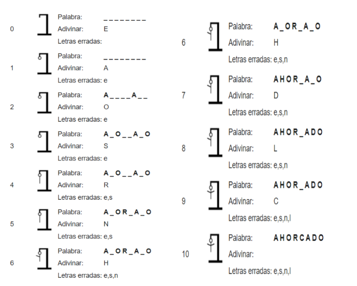

# Análista de datos JR Proyecto Final
## Tabla de contenido:
- [🚀 Introducción][1]
- [¿Qué es el juego del ahorcado? ⚙️][2]
    - [Descripción general 🔩][2.1]
    - [Ejemplo del juego ⌨️][2.2]
- [Actividad 📦][3]

## Introducción 🚀

_El proyecto final consta del desarrollo de un programa que permita la simulación del juego “El ahorcado” en el lenguaje de programación Python. La importancia del uso de la sintaxis y el orden lógico._
## ¿Qué es el juego del ahorcado ? 📋

El ahorcado (también llamado colgado) es un juego de adivinanzas de lápiz y papel para dos o más jugadores. Un jugador piensa, en una palabra, frase u oración y el otro trata de adivinar según lo que sugiere por letras o dentro de un cierto número de oportunidades.

### Descripción general 🔧

Usando una fila de guiones, se representa la palabra a adivinar, dando el número de letras, números y categoría. Si el jugador adivinador sugiere una letra o número que aparece en la palabra, el otro jugador la escribe en todas sus posiciones correctas. Si la letra o el número sugerido no ocurre en la palabra, el otro jugador saca un elemento de la figura de hombre palo ahorcado como una marca de conteo. El juego termina cuando:
* El jugador completa la palabra, o adivina la palabra completa correctamente
* El otro jugador completa el diagrama(dibujo)

### Ejemplo del juego ⚙️

El siguiente ejemplo de juego ilustra a un jugador tratando de adivinar la palabra Ahorcado utilizando una estrategia basada únicamente en la frecuencia de letra.

# Actividad 🔩
Diseña un programa que nos permita realizar la simulación del juego del ahorcado en el lenguaje de programación Python.

__Puntos a evaluar__
* Uso de listas.
* Programación orientada a objetos.
* Declaración de variables y funciones.
* Uso de estructuras de control y ciclos
* Comentarios en el código
* Usos de archivos externos (import)   

---
[Alfonso Gónzalez Zempoalteca](https://github.com/Alfonso6z)

[1]: #introducción-🚀
[1.1]: #pre-requisitos-📋
[1.2]: #instalación-🔧
[2]: #ejecutando-las-pruebas-⚙️
[2.1]: #analice-las-pruebas-end-to-end-🔩
[2.2]: #y-las-pruebas-de-estilo-de-codificación-⌨️
[3]: #despliegue-📦
[4]: #donstruido-con-🛠️
[5]: #contribuyendo-🖇️
[6]: #wiki-📖
[7]: #versionado-📌
[8]: #autores-✒️
[9]: #licencia-📄
[10]: #expresiones-de-gratitud-🎁
