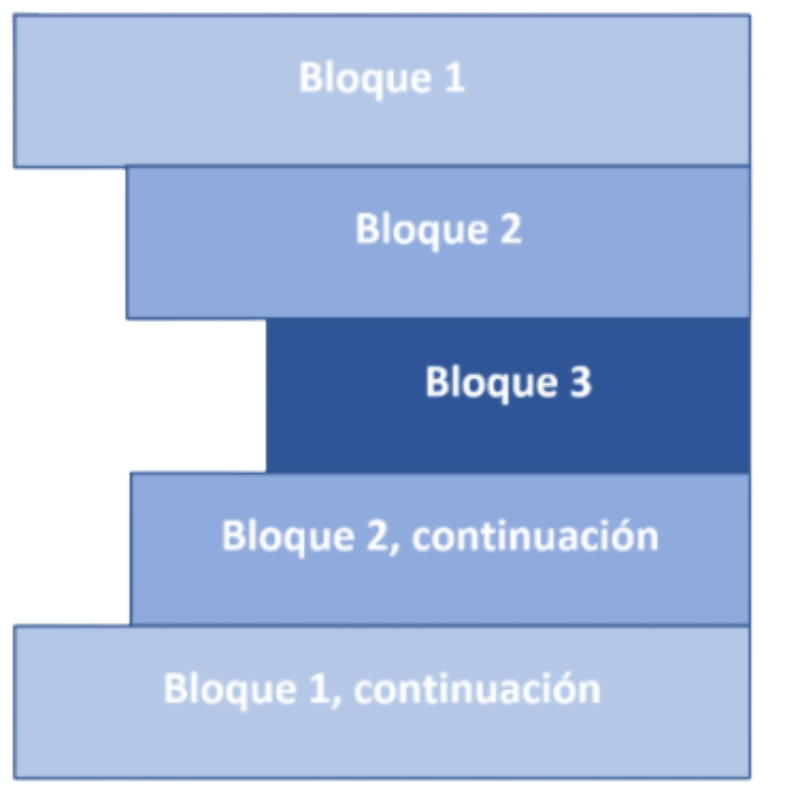

# Indentación en python
Python utiliza la indentación para delimitar la estructura permitiendo establecer bloques de código. No existen comandos para finalizar las líneas ni llaves con las que delimitar el código. Los únicos delimitadores existentes son los dos puntos ( : ) y la indentación del código.

Si buscamos el significado de indentación en Wikipedia indica que  “en los lenguajes de programación de computadoras, la indentación es un tipo de notación secundaria utilizado para mejorar la legibilidad del código fuente por parte de los programadores, teniendo en cuenta que los compiladores o intérpretes raramente consideran los espacios en blanco entre las sentencias de un programa”  

Tenemos que ser muy conscientes del sangrado que realizamos ya que de ello dependerá la lógica de nuestro código. 

A continuación podemos ver un ejemplo de indentación de bloques de código:
